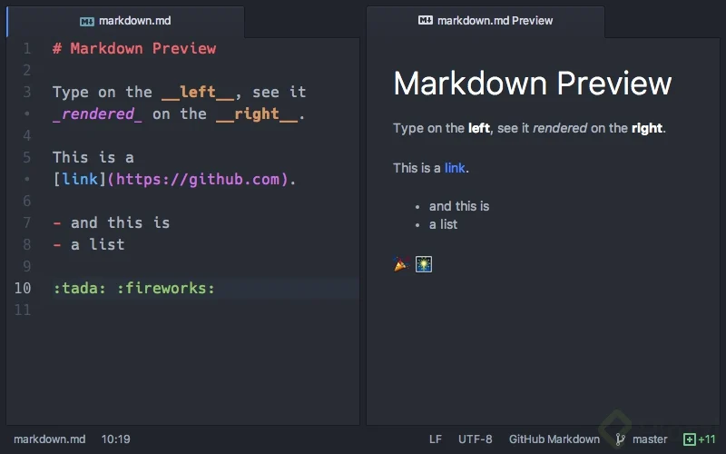
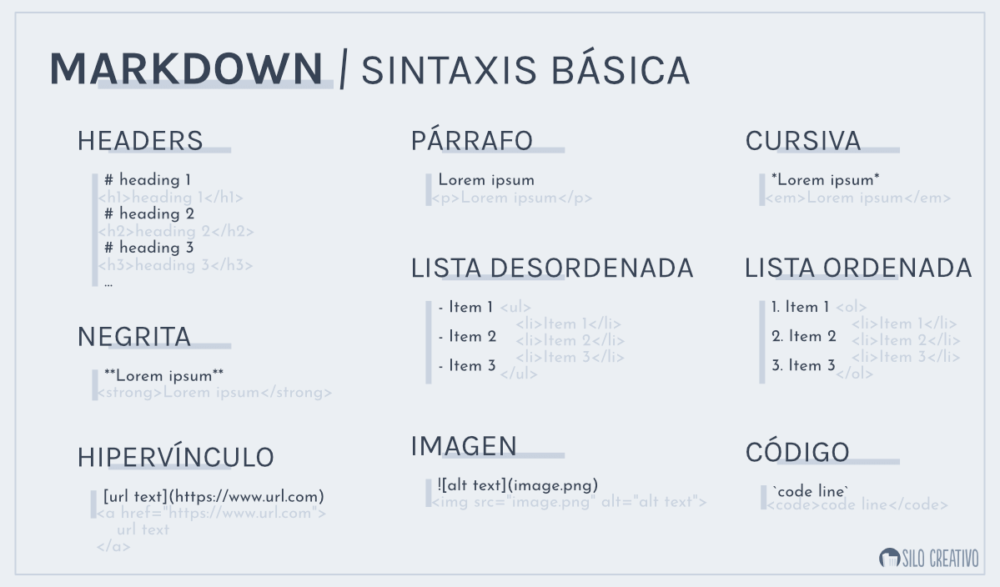
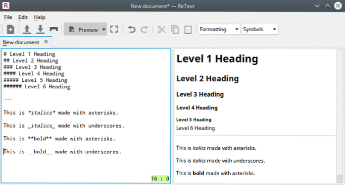

# markdown-ff #
**Imágenes**

 Esto es una imagen dentro del formato.
# ¡Hola hola! #

## ¿Qué es Markdown? ##
Markdown es un lenguaje de marcado ligero creado por John Gruber y Aaron Swartz que trata de conseguir la máxima legibilidad y facilidad de publicación tanto en su forma de entrada como de salida usando texto plano.
**Historia**
En principio se creó en el año 2004, como una alternativa a HTML más simple, y que gente sin mucho conocimiento de este lenguaje de programación pudiese crear páginas web. Pero con el tiempo, se convirtió en un sistema de escritura minimalista con el que poder escribir sin muchas preocupaciones, y que puede ser exportados a otros sitios con facilidad.

Al tener una sintaxis más simple que HTML, es mucho más sencillo de aprender. 

Hay diferentes editores con los que puedes intentar como VSC, Typora , en línea está: https://dillinger.io/

## Ejemplos ##
 
**Enlaces**
  [Prueba1]: https://i.pinimg.com/originals/f1/6a/af/f16aaf867fa70f2ed3b24ec3d8829108.png Esto es un enlace para ver una imagen de referencia.

  [Prueba2]: https://stickerly.pstatic.net/sticker_pack/JM5PD0vBGw1NKsaHcZgjpg/2ZKQ34/13/fb862013-aba8-41b6-9dcd-80c46671e114.png Esto es un enlace para ver una referencia diferente.

### Probando numerales ###
Mientras más...
##### almohadillas... ##### 
gatitos, o numerales coloquemos,
###### más pequeña se hará la letra ######

 ---
 Tengo el poder  ✨
  ___

  De separar las cosas.

 ***
  

  
>Un secreto, los numerales y asteriscos dejan la letra en **negrita**
Pero, ojo con la cantidad, con solo 1 *queda en cursiva*  con 2 **queda en negrita**, no como los numerales.  -djFeña estudiosa
(Otro secreto, acabo de escribir una cita juju (*￣3￣)╭

    Esto puede ser una línea de código
`Esto también puede ser otra línea de código`
[ Esto se ocupa para identificar el lenguaje de programación, sigo descubriéndolo]

  
  
Elementos no ordenados:

+ Parece una lista ordenada,
+ Debe serlo
+ Utiliza el signo *más*
(Usando el signo + se logra)

|Elementos no ordenados y en tablas:|Elementos no ordenados y en tablas:|
|-----------------------|-----------------------|
|* Esto es una lista desordenada|+ Esto es una lista desordenada|
|* Si mezclo los signos los espacios cambian|+ Si mezclo los signos los espacios cambian|
(Usando el signo * se logra)| (En tabla se nota cuál signo se ocupó)

+ Debe ser por los signos
* Que ocupé
* Son cosas que pasan
+ Upsis, que mal se ve esto jeje.

|- Esto igual sirve.|
- Es muy simple.|
(Usando el signo - se logra)

|Elementos ordenados:  |
|-----------------------|
  1. Igual puede ser ordenado si colocamos nº
  1. Visualmente se ve mejor
  1. Definitivamente                                                                   
(Usando nº se logra)

\ Esta barra invertida es clave si quieres que se vean los signos 😉

Links de ayuda y para revisar
[Información]:https://es.wikipedia.org/wiki/Markdown, https://www.markdownguide.org/getting-started/, https://www.silocreativo.com/que-es-markdown-por-que-deberias-empezar-a-usarlo/, https://www.ionos.es/digitalguide/paginas-web/desarrollo-web/tutorial-de-markdown/ y https://markdown.es/sintaxis-markdown/#linkauto

 # ¡Gracias por su atención! #
  